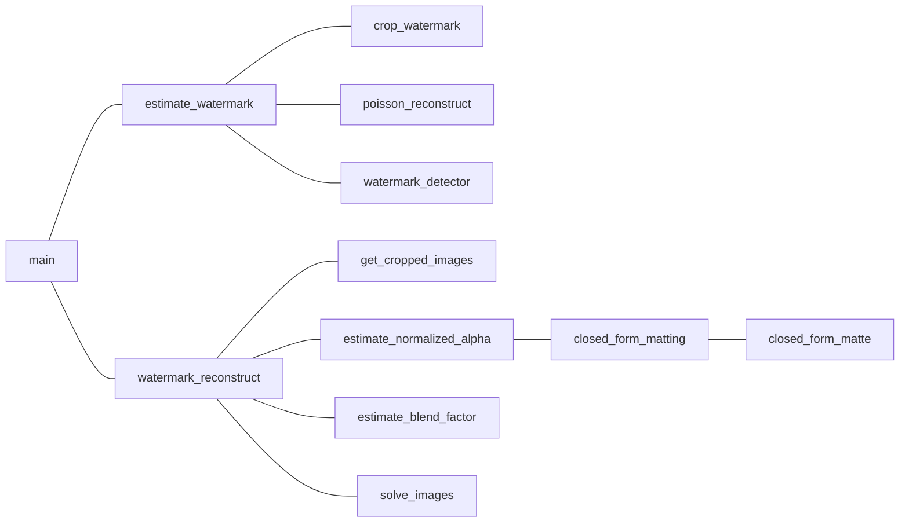

# srtp--watermark-research
## 项目总目标
- 检测并去除水印算法的优化（已选定谷歌2017那篇论文）
- 算法的实际应用场景考虑

## 近期任务

- **DDL：11月1日20:30开会前**
  - 茅一宁
    - 梳理论文思路
    - 列代码、论文对应关系表
  - 徐晓丹
    - 看懂如何求解c
    - 看懂solve_image函数
  - 周寒靖
    - 看参考文献[9]
    - 看懂closed_form_matting.py

- 暂定的11月8日目标
  - 考虑优化思路（？）
  - 整理我们遇到的无法解决的问题，做成ppt给老师看
- 暂定的下下周目标
  - 和黎叔开会，讨论不懂的地方和进一步研究的思路
  - 确立中期答辩目标

## 项目进展
1. 已生成小型素材库（随机/固定位置水印图）  

2. 谷歌的水印算法基本复现，看懂了前半部分，列出了可以优化的点

3. 看论文做了一些笔记

## 项目常态
1. 一周一会

## 函数调用结构

