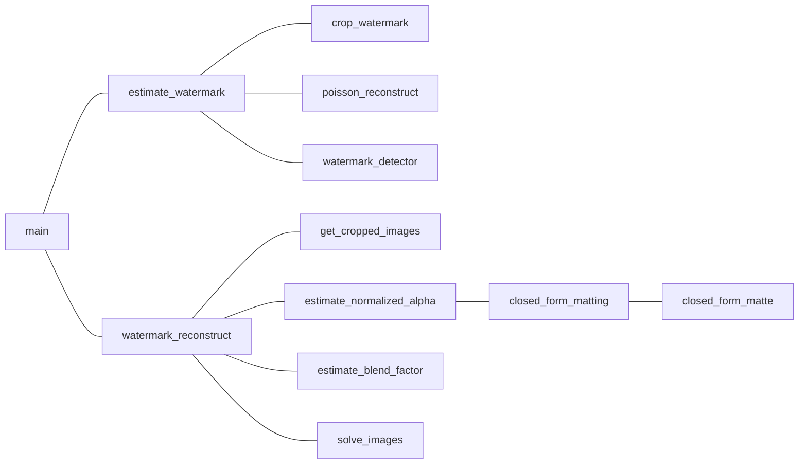

# srtp--watermark-research
## 项目总目标
- 水印检测与去除（谷歌2017论文&GAN）
- 算法的实际应用场景考虑
- 若有可能，考虑论文投稿

## 近期任务

- **学习GAN，Conditional GAN，Inpainting相关知识**
  - 论文《Generative Adversarial Nets》
  - 论文《Conditional Generative Adversarial Nets》
  - 文件路径：“后期文件/论文/”
- **跑通基础教程的例子**
  - 网页链接：https://pytorch.org/tutorials/beginner/dcgan_faces_tutorial.html
  - 也可以直接看ipynb文件：“后期文件/dcgan_faces_tutorial.ipynb”
- **阅读论文《Towards Photo-Realistic VisibleWatermark Removal with Conditional Generative Adversarial Networks》并做笔记**
  - 文件路径：“后期文件/论文/【复现目标】GAN去水印论文.pdf”

## To do list

1. 是否有必要完善谷歌的算法（例如水印位置不固定的情况、解决去水印效果边缘有痕迹的问题）
2. 满屏水印
3. 能不能在GitHub上找到现有的GAN去水印算法？
4. 找⼀些⽔印图，下载Imagenet数据集，贴⽔印+训练
5. cycleGAN以及Pix2Pix模型

## 项目进展
- 已完成中期答辩
  - 已构建素材库（随机/固定位置水印图）  
  - 找到了网传的谷歌去水印算法复现代码，基本理解各个函数的作用
  - 梳理了论文的整体思路
  - 通过图像集分类（亮/暗）的方法改善了去水印效果

## 项目常态
1. 一周一会

## 函数调用结构

