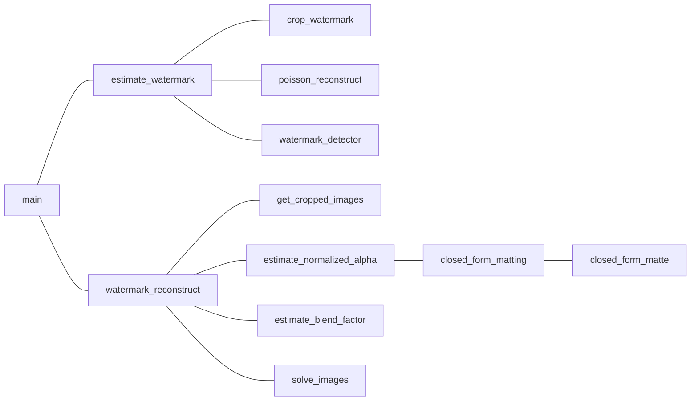

# srtp--watermark-research
## 项目总目标
检测并去除水印算法的优化（已选定谷歌2017那篇论文）
## 项目近期
1、已生成小型素材库（随机/固定位置水印图）  
2、复现谷歌的水印算法  
3、看论文做笔记

## 项目常态
1、一周一会

## 函数调用结构

```mermaid
graph LR
main---estimate_watermark
main---watermark_reconstruct
estimate_watermark---crop_watermark
estimate_watermark---poisson_reconstruct
estimate_watermark---watermark_detector
watermark_reconstruct---get_cropped_images
watermark_reconstruct---estimate_normalized_alpha---closed_form_matting---closed_form_matte
watermark_reconstruct---estimate_blend_factor
watermark_reconstruct---solve_images
```

