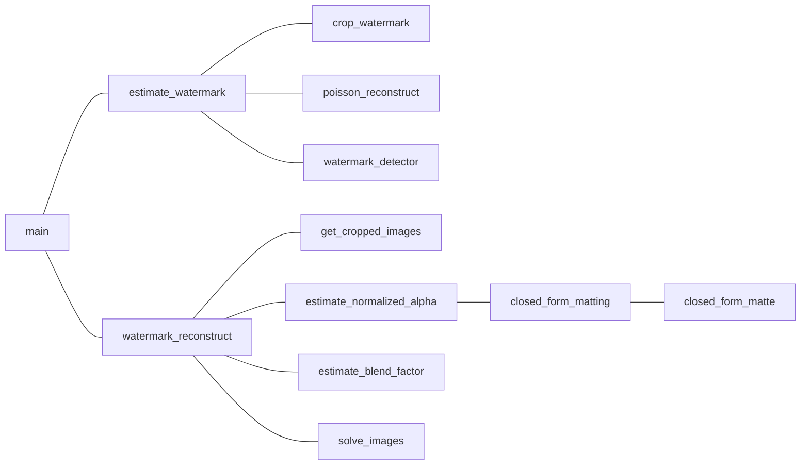

# srtp--watermark-research
## 项目总目标
- 检测并去除水印算法的优化（已选定谷歌2017那篇论文）
- 算法的实际应用场景考虑

## 近期任务

- **制作PPT，联系老师开会（尽快完成）**
  - 茅一宁
    - 论文思路
  - 徐晓丹
    - 我们所认为的代码中的可优化处
    - 目前算法运行的结果
  - 数学公式推导看不懂该怎么办？
  - 中期答辩需要进行到什么程度？
  - 中期之后，在大方向上我们能进行什么优化？有哪些应用（做个app？检测淘宝小广告？）

## To do list

1. blend factor (代码中的c) 是怎么求的？最小二乘法（试试scipy的leastsq？）
2. chamfer distance
3. 代码中没有写如何对一张新的图像去水印（已知α，W，如何对一个新的Jk求Ik）
4. 用自己的图片库跑一遍算法

## 往期分工记录

10月25日-11月1日

- 茅一宁
  - 梳理论文思路
  - 列代码、论文对应关系表
- 徐晓丹
  - 看懂如何求解c
  - 看懂solve_image函数
- 周寒靖
  - 看参考文献[9]
  - 看懂closed_form_matting.py

## 项目进展
1. 已生成小型素材库（随机/固定位置水印图）  
2. 找到了网传的谷歌去水印算法复现代码，基本理解各个函数的作用
3. 梳理了论文的整体思路

## 项目常态
1. 一周一会

## 函数调用结构

